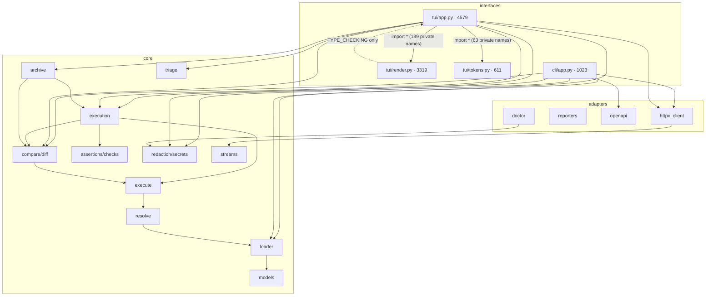

# Code Health Report

**Project:** comparo — HTTP regression & diff testing (TUI + headless CLI + CI)
**Date:** 2026-07-18 (re-audit after the `remediation/code-health-a-grade` branch; supersedes the same-day C-grade report)
**Stack:** Python 3.13, msgspec, ruamel.yaml, httpx / httpx-sse, typer, textual, jsonschema
**Size:** 41 src files, 16,034 LOC; 34 test files, 6,983 LOC; 8 runtime deps
**Method:** static gates (ruff, ruff-format, mypy --strict, import-linter — all green) + full suite (323 passed, 53s, 77% branch coverage) + six parallel verification/audit passes. Every prior critical/high finding was re-tested by running code (wire-level repros against localhost servers, Textual Pilot for the TUI), not re-read.

## Executive Summary

**Overall grade: B+ (up from C).** The remediation is real and verified: the critical silent-header-drop bug, all three secret-redaction bypasses, the status-not-compared gate hole, the timeout hang, the config silent-false-green class, the OpenAPI import breakage, and all seven one-bad-input-kills-the-run crashes are **fixed, wire-proven, and pinned by regression tests**. The engine you'd trust to gate CI now largely earns it: no false-green path was found in a dedicated adversarial sweep, and the e2e suite is genuinely strong.

What stands between B+ and A is a short, named list: **(1)** the rewritten live-run counters are stuck at `0 ✓ 0 ✗` — the fix tallies glyphs the app never writes, and its own regression test feeds synthetic glyphs, so it passes while the UI shows zeros; **(2)** the TUI split is glued with a 139-name star-import of private symbols under a file-wide `noqa: F405`, disarming undefined-name analysis over 29% of the codebase; **(3)** `Redactor.for_project` is rebuilt at ~40–50 TUI call sites, doing secret-file I/O on render paths with silent mask-shrink on failure; **(4)** the PyPI name `comparo` is still unregistered (404) while an alpha tag and live release automation now exist — squattable, and the in-app update check points at it.

Release-engineering note: a `1.0.0` tag briefly existed on 2026-07-18 and was correctly rolled back to a 0.x alpha track (`allow_zero_version = true`). History was rewritten in the rollback; source content is unchanged from the audited tree. The dev venv runs Python 3.14.6 while the project targets 3.13 — CI should test the floor version explicitly.

## Scorecard

| Category                  | Grade | Open findings | Prior |
|---------------------------|-------|---------------|-------|
| Spaghetti & Complexity    | B     | 6             | C     |
| Coupling & Architecture   | B−    | 4             | C+    |
| Consistency & Patterns    | B     | 5             | C     |
| Dead Weight               | A−    | 3             | C     |
| Security                  | B+    | 7             | D+    |
| Error Handling            | B+    | 5             | D+    |
| Testing                   | B+    | 3             | C+    |
| Configuration             | B     | 8             | C−    |
| Documentation             | B+    | 3             | C     |

## Prior-Findings Ledger

Of the previous report's **1 critical + 23 high + 36 medium** findings:

- **Critical:** C1 (mapping headers dropped + endpoint never interpolated) — **FIXED**, wire-proven; AGENTS.md template now matches the canonical shape and runs green.
- **High:** 19 of 23 **FIXED** (H1–H12, H14, H15, H17–H21 — including all redaction bypasses, `$status` diffing, strict diffPairs/manifest structs, timeout defaults + total deadline, OpenAPI auth/refs, README quickstart, `q`-always-quits, root/data_dir split, checks→assertions unification). H16 **partial** (drill-in no longer asserts fault; a real outbound comparison exists but only on the Diff tab, and the hint's `o` key dead-ends from Execution). H22 **fixed with residual** (transcript gone from tree *and* history; see S-6). H13 **regressed differently** (see H-1). H23 **still open** (see H-4).
- **Medium:** 23 fixed (M1–M9, M11, M12, M14, M16–M20, M23, M25, M27, M28, M33, M35), 6 partial (M13, M22, M26, M30, M32, M36), 7 open (M10, M15, M21, M24, M29, M31, M34). All carried forward below at current severity.

## Dependency Graph

Layering (`cli`/`tui` → `adapters` → `core`, core imports no HTTP library) is real, CI-enforced, and was re-verified beyond import-linter: no runtime cycles, no upward imports, no shared mutable module-level state. Fan-in is where it should be (`models` 21, `loader` 16, `resolve` 11). The one anomalous edge is the star-import glue inside `tui/`.

## Critical Findings (fix before shipping)

**None.** Nothing found in this pass rates critical. (The prior critical, C1, is fixed and regression-tested.)

## High Priority Findings

### H-1 · Live-run counters are permanently `0 ✓ 0 ✗`, errored cells render as ✓ — and the regression test masks it
**Where:** `src/comparo/tui/render.py:2142-2143` (tally), `src/comparo/tui/app.py:1827,1838,3731,3736,3740` (writers), `tests/test_tui.py:1558-1566` (the masking test), `src/comparo/core/execution.py:151-161` (`ExecutionProgress`).
**What:** The old fabricated `"0 ✗"` literal was replaced with a real tally — but the tally counts `"✓"`/`"✗"` glyphs while every production caller writes only `"○"/"◐"/"●"`. Pilot-reproduced: after 2 finished cells (1 drifted), the header reads `2/3 cells   0 ✓  0 ✗`. The regression test passes glyphs `["✓","✓","✗","◐"]` — a vocabulary the app never produces — so CI is green while the UI shows zeros. Separately, `ExecutionProgress` carries only `drift`, so a cell that errored or failed assertions (no field drift) renders ✓ in the finished log.
**Why it matters:** This is the headline live view of a trust tool, it regressed *while being fixed*, and the test that guards it verifies the wrong contract. (Genuinely fixed from the old H13: throughput literal gone, env labels real.)
**Fix:** Emit pass/fail state on `ExecutionProgress` (e.g. `state: "ok" | "drift" | "error" | "assert-fail"`) instead of inferring from glyph strings; tally from that; rewrite the test to drive `update_progress` with real progress objects from a run, not hand-fed glyphs.

### H-2 · The TUI split is glued with star-imports of 202 private names under file-wide lint suppression
**Where:** `src/comparo/tui/app.py:106-108` (`from comparo.tui.render import *`, `...tokens import *`), `app.py:10-12` (`# ruff: noqa: F405` for the whole 4,579-line module), `render.py:118` (`__all__` of 139 underscore names), `tokens.py:21` (63 more).
**Why it matters:** (a) ruff can no longer flag an undefined name anywhere in the largest file in the codebase — a typo'd helper fails at runtime on whatever keypress reaches it. (b) Provenance is opaque: `_short` exists in four modules with two different meanings; in the merged namespace, "the" `_short` is whichever module won. (c) Nothing guards against a future silent shadowing collision (zero collisions today — verified — but no tool checks it).
**Fix:** Mechanical: `from comparo.tui import render` + qualified calls, delete both pragmas, drop the `__all__`-of-privates. Re-arms static analysis over 29% of the codebase; do it before the next TUI feature.

### H-3 · `Redactor.for_project` rebuilt at ~40–50 TUI call sites — secret-file I/O per render, silent mask shrink
**Where:** 37 direct constructions (35 in `tui/app.py` — e.g. `app.py:422-471` has seven in one method — 2 in `tui/render.py`) plus wrapper calls via `render.py:1329 _app_redact`; `core/redaction.py:53-58` (fresh `ExecuteSecrets` per call; `except SecretError: continue`).
**Why it matters:** Every construction re-resolves every declared secret — including `$file` reads from disk — on tree-cursor moves and progress ticks. A secret file that becomes unreadable mid-session silently drops out of the mask set for subsequent renders: the "never leak" guarantee quietly narrows exactly when something is wrong. And 40+ call sites are 40+ places to forget masking.
**Fix:** One cached redactor on `ComparoApp`, built at load, invalidated on reload (`r`); make `_app_redact` the only construction site. Surface (don't skip) a secret that fails to resolve.

### H-4 · PyPI name `comparo` still unregistered while an alpha tag and release automation are live
**Where:** `https://pypi.org/pypi/comparo/json` → 404 (re-checked this session, after the alpha tag was cut); `adapters/updates.py:16` (update check targets that URL), `action.yml:39` (`uv tool install comparo…`), README install instructions.
**Why it matters:** Anyone can register the name today; a squatter then controls what the in-app update toast advertises and what `pipx install comparo` / the GitHub Action installs. The window is now — the tag and release workflow exist, the name doesn't.
**Fix:** Reserve via a PyPI pending publisher bound to this repo (or push the alpha) before any further public activity.

## Medium Priority Findings

**Correctness / fail-closed:**
- **M-1 · `comparo run` exits 0 on a zero-execution run.** `cli/app.py:297-326` checks for zero *requests* but not zero *executions*; a request whose matrix expands to no cells (e.g. `values: []`, which validates — `models.py:124` has no min-length) prints a bare header and exits green. `diff` and `exec` both fail closed on this; `run` is the odd one out.
- **M-2 · `${VAR?}` unset optionals go out as the literal string `"None"`** in query, header, and cookie positions (prior M10, wire-proven again; `core/interpolation.py:116`, `adapters/httpx_client.py:52-53,66`). Documented behavior is omission. Filter `None`-valued pairs before send.
- **M-3 · `comparo render` crashes with a raw traceback on any `InterpolationError`** (e.g. a `$val` cycle or unset required var — both pass `validate`): `cli/app.py:290-294` has no handler, unlike the run/diff/exec paths. Also: `validate` doesn't detect `$val` cycles, so the first surface to report one is a crash.
- **M-4 · `httpx.InvalidURL` aborts the entire multi-request run.** `adapters/httpx_client.py:67-77` builds the request outside the `try/except httpx.HTTPError`, and `InvalidURL` is not an `HTTPError`. Reproduced with `baseUrl: "http://[::1"`: whole run lost, zero results — violating `execute.py`'s own "one bad request never aborts a run of many". Move `build_request` inside the try and translate. Related belt-and-braces: add a per-cell `except Exception → CellOutcome(error=…)` in `execution.py:224-276` `_run_cell` — fail-closed, and it would have downgraded all seven historical whole-run crashes to one red cell.
- **M-5 · Saved bodies crash redaction at ~1000 levels of nesting.** `core/export.py:106-115` and `core/archive.py:181-193` recurse per level with no cap; the diff engine caps at 200 but stores the *whole* parsed body, so a body that diffs fine crashes on TUI save (`app.py:876-880` catches only `OSError` → panic). Rewrite iteratively or truncate at `diff._MAX_DEPTH`. (Also add `RecursionError` to the except tuples at `assertions.py:323-327` and `streams.py:73-76` — ~120k-deep JSON escapes both.)

**Security (residuals from largely-fixed areas):**
- **S-1 · The 64 MB body cap truncates silently, and doesn't apply to the streaming branch.** `httpx_client.py:139` bare `break` — a >64 MB response is diffed as if complete (false-green vector for exactly this tool); `HttpResponse` has no `truncated` flag. The streaming branch (`httpx_client.py:109-125`) has no byte cap at all and `stream_max` defaults to `None`. Surface truncation as an error or flagged drift; apply the cap to both branches.
- **S-2 · `spec.data` is not confined to the project root** while `report.dir`/`report.output` now are (`loader.py:364-378`): `data: ../../../tmp/x` relocates `.reports/` writes outside the project (`archive.py:417-424`). Apply the same guard.
- **S-3 · `action.yml:39` still interpolates `${{ inputs.version }}` directly into bash** (`uv tool install "comparo${{ inputs.version }}"`) — the other four inputs were correctly moved to `env:`. Same fix.
- **S-4 · Silencing can write to a profile that isn't composed for the request** (prior M13, narrowed): for a request with an *inline* diff, `profile_for` (`compare.py:259-284`) falls back to the project default profile — but `_compose_diff` (`compare.py:204-220`) never applies the default when `response.diff` is set, so the confirmed write lands in a file that doesn't affect the re-run. (Real improvements landed here: honest refusal when no profile exists, and a refusal to write secret-bearing paths into tracked files — `app.py:1780-1795`.) Return `None` from `profile_for` for inline-diff requests, or offer to edit the inline block.

**Saved-report replay (the remaining fabricated-display cluster, prior M21/M24):**
- **M-6 ·** Replay stamps every drift `mode: exact` / skip `· ignore` as if they were data (`render.py:2746-2748`, hardcoded again at `app.py:2599,2615,2619`); drifted variants render as green ✓ (`app.py:2653-2658`); and the DRIFT INDEX is still inert — cursor movement never changes the COMPARE well because `on_data_table_row_highlighted` doesn't handle `report-drift-table` (`app.py:2504-2514`; `render.py:2711-2716` always returns the first drifted cell). Either persist per-path modes in the archive (see M-8) or stop displaying invented ones; wire the highlight handler.

**Architecture / duplication (the drift-risk cluster):**
- **M-7 · Run and Diff views still reimplement core orchestration inline** (`app.py:815-846`, `1811-1868`) because `execute_all`/`diff_run` lack the `on_progress` seam `run_execution` has — and ExecutionView (`app.py:3758`) proves the delegation pattern works. The two copies already disagree with core on pacing (per-cell pairing vs whole-run concurrency). `render.py:1886-1901` is still a verbatim copy of `execution._select`. Add the seam, delete the copies.
- **M-8 · Three parallel "summarize a run" pipelines + a hand-rolled archive codec.** `report.build_report`, `execution.build_execution_report`, and `archive.record_from_*` each reimplement state classification and gate math; `cli/app.py:952-984` re-flattens instead of using `checks.run_checks` (whose docstring exists to prevent exactly this). The archive additionally uses snake_case keys while every other artifact is camelCase, via ~105 lines of lenient codec (`archive.py:486-586`) that zero-fills bad fields and accepts `version: 99` without complaint — the version field added for M22 is stamped but never enforced. Extract one classifier; msgspec-ify the archive (`rename="camel"`, `ARCHIVE_VERSION = 2`, legacy reader for 0/1, reject futures).
- **M-9 · Security-relevant helpers duplicated:** the json-render `_short` is byte-identical in `assertions.py:404` and `diff.py:227` (its comment explains the leak it prevents); `archive.py:181 _redact_body` mirrors `export.py:106 _redact_value` by admission. A fix applied to one copy silently reopens the other sink. Move both into `redaction.py`.
- **M-10 · Crash reporting couples to Textual private internals** (`app.py:4190-4210` manipulates `App._exception`/`_exception_event`/`_return_code`) with `textual>=0.86.0` unbounded. A Textual rename silently breaks the *redacted* crash path. Add an upper bound or a 3-line CI assertion that the attributes exist.
- **M-11 · Decomposition debt in the two core hotspots:** `loader._check_profiles` (`loader.py:236-379`) is 144 lines / five closures / six unrelated validations — the security-relevant report-path confinement is buried in a function whose name says "profiles"; `execution.run_execution` (`execution.py:164-293`) mixes plan expansion, concurrency, progress plumbing, and assembly. Promote the closures to testable `_validate_*` functions; extract `_build_plan`. Related: `render.py`'s builders thread 8–10 positional params through recursion (`_build_report_tree` 10, `render.py:965`) — a small frozen context object would remove the transposition hazard.

## Low Priority Findings

**Config/CLI:** `$literal` still doesn't shield a `$ref`-shaped payload (`loader.py:382-392` — the documented escape hatch can't hold the one thing it exists for); object discovery globs only `*.yaml`, silently ignoring `.yml`; `comparo schema -o dir/file.json` tracebacks when the parent dir is missing (`cli/app.py:260`); every failure still exits 1 (gate fail, bad config, and internal crash are indistinguishable to CI); `--report` format validation runs *after* the HTTP run (`cli/app.py:367,458` — a typo costs a full run), leaving `_write_reports`' unknown-format branch (`858-863`) unreachable; `save_user_config` is still a non-atomic truncating write (`userconfig.py:109`; impact softened by the tolerant loader); `redaction.stringMatchBackstop` remains accepted-but-inert (now documented as always-on — defensible, but it's a dead knob); empty `matrix.values: []` validates; `.reports/` retention exists (`archive.prune`, `save_record(keep=)`) but **no caller passes `keep`** — the archive still grows unbounded by default; the `$val` cycle message renders from an unordered set (can start mid-cycle).

**Error-handling polish:** `execution.py:252` merges baseline/candidate errors into one string, losing which env failed (candidate's error silently dropped when both fail). The depth-200 diff cap is a sound, *visible* tradeoff but undocumented in user docs.

**Security (theoretical tier):** credential-header masking is a fixed allowlist (`redaction.py:26-36`) — nonstandard `x-auth-token`-style headers persist verbatim; base64- or `\u`-escaped copies of a secret aren't matched (requires the server to actively re-encode the echo — low realism). **S-6 (publish-safety residual of H22):** the transcript is confirmed gone from working tree *and* all of git history, but `.gitignore:46`'s comment and the previous revision of this report (tracked, so present in history) still reference the private engagement the cleanup removed. Scrub the comment, and rewrite the commits carrying the old report text before open-sourcing.

**TUI phantom hints:** `_REPORT_RUN_KEYS` advertises `⏎ drill` and `z maximize` bound to nothing (`tokens.py:359-360`, `app.py:2293-2300`); `_EXEC_CELL_KEYS` advertises `⏎ open diff` (real key: `d`); report-browse footer advertises `esc ⌫ close` that early-returns (`tokens.py:344` vs `app.py:2691-2692`); the Execution drill-in hint points at key `o`, which only exists inside DiffView.

**Docs:** README:100 still lists `cookies` as an Environment field (it's Request-level) and elides `secrets` as "credentials"; `docs/cli.md:739` example uses `wbenbihi/comparo@v1` — no `v1` tag exists; classifier `Development Status :: 3 - Alpha` is right for the 0.x track — keep it in sync when leaving alpha.

**Dead weight (the complete list — the tree is otherwise unusually clean: zero TODO/FIXME, zero commented-out code, no unused deps):** `redaction.identity` never called (callers default to `str`); `assertions.run_assertions` is a public orphan kept alive by one test; the unreachable `_write_reports` branch above. Naming: `execute/execution`, `checks/assertions`, `compare/diff` are three near-synonym module pairs — all load-bearing, but navigation is guesswork; consider `execution → profile_run`, `checks → run_verdict` renames.

**Testing gaps:** `tui/render.py` — 3,319 LOC, no dedicated test file (its pure formatting helpers are exactly where M5-class bugs lived; a `test_render.py` is the single highest-value test to add); `tui/app.py` at 63% coverage; the H-1 glyph test must be rewritten against real progress objects. Everything else in testing is strong: behavior-asserting e2e over real sockets, gate semantics pinned, ports faked at the architectural seam, no live network, `COMPARO_CONFIG_HOME` isolation intact.

## Refactor Roadmap

Each phase is one focused PR; 1–3 are the A-grade blockers.

**Phase 1 — Restore trust in the live view (H-1).** Add pass/fail state to `ExecutionProgress`, tally from state not glyphs, show ✗ for errored/assert-failed cells, and rewrite the regression test to feed real progress objects. Small, user-visible, and it closes the only finding where a fix shipped broken with a green test.

**Phase 2 — Re-arm static analysis and cache the redactor (H-2, H-3).** Replace the star-imports with qualified `render.`/`tokens.` access, drop both `noqa` pragmas; one cached `Redactor` on the app with loud resolution failures. Both mechanical; do them before any further TUI work.

**Phase 3 — Publish safety (H-4, S-3, S-6).** Reserve the PyPI name (pending publisher) *now*; fix the `action.yml` version interpolation; scrub the `.gitignore` comment and the old report revision from history. Nothing else blocks going public.

**Phase 4 — Fail-closed stragglers (M-1…M-5, S-1, S-2).** Zero-execution `run` gate; drop `None`-valued optional pairs; `render` error handler + load-time cycle detection; move `build_request` into the adapter's try + per-cell catch-all in `_run_cell`; iterative save-path redaction; truncation flag + streaming cap; confine `spec.data`. Each is a one-file change with an obvious test.

**Phase 5 — One verdict pipeline (M-7, M-8, M-9).** `on_progress` for `execute_all`/`diff_run` and delete the inline TUI orchestration; one cell-state classifier consumed by report/execution/archive/CLI; msgspec archive codec with enforced versioning; `_short`/`_redact_value` into `redaction.py`. This retires the class of "TUI and CI disagree" bugs permanently.

**Phase 6 — Structure and polish (M-6, M-10, M-11, lows).** Wire the replay DRIFT INDEX and stop rendering invented modes; split `tui/app.py` per screen (natural after Phase 2); decompose `_check_profiles`/`run_execution`; Textual version bound; `test_render.py`; phantom hints; docs nits; distinct crash exit code.
