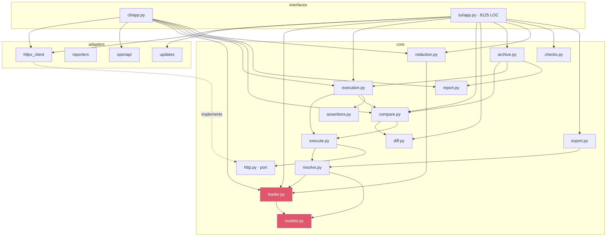

# Code Health Report

**Project:** comparo — HTTP regression & diff testing (TUI + headless CLI + CI)
**Date:** 2026-07-18
**Stack:** Python 3.13, msgspec, ruamel.yaml, httpx / httpx-sse, typer, textual, jsonschema
**Size:** 70 source files, ~19.7k LOC (src 14.7k, tests 4.9k); 8 runtime deps. `src/comparo/tui/app.py` alone is 8,125 lines.
**Method:** static tooling (ruff, mypy --strict, import-linter — all green) + a 15-dimension adversarial multi-agent audit with per-claim refutation (151 raw findings → ~90 distinct issues; 75+ independently confirmed, 1 refuted). Every critical/high item below was reproduced by running code, not inferred.

## Executive Summary

**Overall grade: C.** The engine's *design* is genuinely A-grade — a clean ports-and-adapters core with CI-enforced layering, a thoughtful secret-masking model, and a tri-state diff. But the *behavior* ships a gap between promise and reality that a professional showcase can't carry: **one CRITICAL silent-failure bug** (mapping-form request headers are dropped — and comparo's own scaffolded `AGENTS.md` teaches that exact shape), **multiple confirmed bypasses of the headline "never leak a secret" guarantee**, **pervasive "one bad input crashes the whole run" error handling**, and a large TUI that renders **fabricated live metrics** ("0 ✗", "~410ms/cell") and mislabels which environment a saved run belongs to.

**Fix before publishing (blocking):**
1. Mapping-form headers silently dropped + `${VAR}` not interpolated in endpoints — both taught by the scaffolded AGENTS.md (CRITICAL).
2. Secret-redaction bypasses: JSON-special-char leak, `export.py`'s non-longest-first copy, server-issued credentials never masked (HIGH security).
3. Diff engine never compares HTTP status — a 200→500 with identical bodies passes the gate (HIGH).
4. No default HTTP timeout + no total-response deadline — a slow/stalled server hangs CI forever (HIGH).
5. `docs/design/` publishes a raw AI-session transcript disclosing an NDA client engagement and local `/Users/walid` paths; the PyPI name `comparo` is unregistered and squattable (HIGH security/publish-safety).

**Already fixed during this audit** (committed to the working tree): added the missing `packaging` runtime dependency (a plain `pip install comparo` crashed the TUI on launch); hardened `archive.load_record` against non-object JSON; added test isolation of the user config; and added 21 non-regression tests (`test_e2e.py`, `test_distribution.py`, `test_persistence.py`, `conftest.py`).

## Scorecard

| Category                  | Grade | Findings |
|---------------------------|-------|----------|
| Spaghetti & Complexity    | C     | 4        |
| Coupling & Architecture   | C+    | 6        |
| Consistency & Patterns    | C     | 9        |
| Dead Weight               | C     | 6        |
| Security                  | D+    | 9        |
| Error Handling            | D+    | 18       |
| Testing                   | C+    | 11       |
| Configuration             | C-    | 9        |
| Documentation             | C     | 12       |

Security and error handling are the two failing dimensions, and they matter most: comparo's entire value proposition is "trust this to gate your CI and never leak your secrets," and both promises have confirmed, reproducible holes.

## Dependency Graph

The layering contract (`cli`/`tui` → `adapters` → `core`; core imports no HTTP library) is real and CI-enforced. The weakness is *inside* the boundary: `tui/app.py` re-implements core orchestration rather than calling it.



**High fan-in (change with care):** `models.py` and `loader.py`/`LoadedProject` are imported by nearly every core module. **Duplication hotspots (red flags):** `tui/app.py` re-implements `execute_all`/`diff_run` orchestration inline (3rd copy of the semaphore loop), copies `execution._select` verbatim, carries a second SSE parser and a second redaction path via `checks.py`, and rebuilds `Redactor.for_project` at ~37 call sites.

---

## Critical Findings (fix before shipping)

### C1 · Mapping-form request headers are silently dropped — and the scaffolded AGENTS.md teaches that exact shape
**Where:** `src/comparo/core/resolve.py:251-265` (`_header_pairs`), `src/comparo/core/models.py:77` (`headers: Any`), `src/comparo/cli/app.py:793` (AGENTS.md template).
**Reproduced:** A request with
```yaml
headers:
  Authorization: "Bearer ${API_TOKEN}"
```
passes `comparo validate` and runs green, but the request goes out with **no headers at all** (`_header_pairs` only reads a *list* of `{key, value}` and returns `[]` for a mapping; `headers` is typed `Any` so msgspec and the JSON Schema accept anything). The same example additionally shows `endpoint: /users/${USER_ID}` — and **endpoints are never interpolated** (`resolve_request` builds the URL directly; only a path-Matrix fills `${...}`), so `${USER_ID}` is sent literally.
**Why it's critical:** the mapping shape and the `${VAR}`-in-endpoint shape are *exactly* what `_AGENTS_MD` — dropped into every `comparo init` project for coding agents to follow — documents (`cli/app.py:791-793`). So an agent following comparo's own guide produces requests whose auth silently never goes on the wire, and a CI diff gate green-lights unauthenticated behavior. This is the precise "silent false green" the loader's docstrings claim is impossible.
**Fix:** accept the mapping form (`HttpRequest.headers: list[Header] | dict[str, Any] | None`, convert in `_header_pairs`) *or* reject it with a load diagnostic; interpolate the endpoint through the resolver like every other field; constrain `headers` in the JSON Schema; and make the AGENTS.md/README example match whichever shape is canonical.

---

## High Priority Findings

### Security — the "never leak" guarantee has confirmed bypasses
The headline feature is that a declared secret never appears in any output; `comparo doctor` proves it with a canary. The canary (`s3cr3t-CANARY-a1b2c3d4e5f6`) has no special characters and is a single value, so it passes while three real holes stay open:

- **H1 · JSON-special-char leak.** `src/comparo/core/redaction.py:52-57` via `diff.py:224` / `assertions.py:366`. `diff._short()`/`assertions._short()` run `json.dumps()` **before** the Redactor's raw `str.replace`. A secret `p@ss"w0rd` is serialized as `p@ss\"w0rd`, the substring match misses, and the human-readable secret lands in drift details, `.reports/*.json`, JUnit/SARIF/Markdown (committed to git / posted to GitHub step summaries), and CLI stdout. *Reproduced.* **Fix:** register the JSON-escaped inner form alongside each raw secret, or redact the parsed value before serializing; add a canary containing `"`, `\`, `\n` to `doctor`.
- **H2 · `export.py` dropped the longest-first invariant.** `src/comparo/core/export.py:106-109` re-implements redaction over an **unordered set**, so with secrets `{token, token-SUPERSECRET}` the shorter can mask first and the tail `-SUPERSECRET` survives into `runs/*.json`. `redaction.py:49-50` sorts longest-first with a comment explaining exactly this hazard; the copy in `export.py` doesn't. *Reproduced.* **Fix:** delete `export.py`'s private `_redact`/`_secret_values`/`_MASK` and take a `redact: Redact` param so there is one implementation.
- **H3 · Server-issued credentials are never masked.** `MEDIUM`-rated but security-relevant: redaction only masks values of *declared* secrets. A `Set-Cookie` session token or an echoed `Authorization` the server returns is persisted verbatim to saved reports and exports. **Fix:** redact response `Set-Cookie`/auth headers by policy, independent of the declared-secret set.

### Correctness — the gate can pass when it shouldn't
- **H4 · HTTP status is never compared.** `src/comparo/core/compare.py:130-168`. Status is captured as baseline-only metadata and never diffed; `comparo diff` runs no assertions. *Reproduced:* baseline 200 vs candidate 500 with identical bodies → `gate: PASS`, exit 0. An empty/identical error body with the wrong status is the single most common regression this tool exists to catch. A strict xfail test is now in `tests/test_e2e.py`. **Fix:** emit a synthetic `$status` `FieldDiff` (exact mode, ignore-able) in `_compare`.
- **H5 · A one-char typo in a `diffPairs` key compares an env against itself → PASS.** `src/comparo/core/resolve.py:100-108`. `candidate:`→`candid:` makes `_find_pair` return `None` for that side, `select_environment(None)` falls back to the default, and `comparo diff` prints `Local ⇄ Local` → every cell "same" → green CI while the real candidate was never contacted. `validate` accepts it (whole `spec.environments` block is `Any`). *Reproduced.* **Fix:** error when a matched pair lacks a side; model `diffPairs`/`default` as strict structs.
- **H6 · A lone `--baseline` (or `--candidate`) is silently ignored.** `src/comparo/core/resolve.py:84-90`. `resolve_pair` only honors the flags when *both* are present; otherwise it falls through to the manifest pair. *Reproduced:* `comparo diff --baseline staging` prints `Local ⇄ Prod`. A CI job templating one env flag gates the wrong pair. **Fix:** error (or overlay) when exactly one flag is given.

### Resilience — a slow or stalled server hangs CI forever
- **H7 · No default timeout, and no total deadline for non-streaming reads.** `src/comparo/adapters/httpx_client.py:51-56,112`; `core/http.py:37-47`. An environment without a `timeout:` block yields `httpx.Timeout(None)` (overriding even httpx's 5s default). And the read timeout is per-socket-read, so a server trickling 1 byte/sec never trips it — the non-streaming branch buffers to EOF with no cap. *Reproduced:* `comparo run` against a trickle server still running at 40s (killed by SIGALRM). In CI this blocks until the job's hard limit. **Fix:** give `TimeoutBudget` sane defaults (connect 5s / read 30s, matching the scaffold), and wrap the non-streaming send in `asyncio.timeout(total)` like the streaming branch already is.

### Config engine — silent no-ops and uncaught crashes from valid-looking config
All *reproduced*; all pass `comparo validate`:
- **H8 · Matrix `target` is an unvalidated free string** (`resolve.py:228-239`, `models.py:116`): a typo like `request.qeury` (or `request.headers`) expands into cells whose injection silently no-ops, while the provenance trail falsely records it as applied. **Fix:** validate `target ∈ {query, body, path}` at load; append the Trail entry only after a real dispatch.
- **H9 · A bare-string or wrong-kind `matrix:` ref is silently dropped** (`matrix.py:96-111`): the request runs as a single unmatrixed cell, so the regression coverage vanishes and the zero-cells fail-closed guard never fires. **Fix:** validate each entry like assertion includes.
- **H10 · A `$val` cycle between Instances loads clean then crashes with `RecursionError`** at resolve time (`resolve.py:282-300`), escaping `execute_request`'s error capture (`execute.py:67`) — one bad object aborts the whole run. **Fix:** seen-set cycle guard, or detect at load.

### OpenAPI import — produces projects that can't run
- **H11 · Basic-auth import emits `${API_USERNAME}` but never declares it** (`openapi.py:304-307`) → `InterpolationError` on every request; the "export these vars" hint omits it. **Fix:** declare `API_USERNAME` as a `$env` secret too.
- **H12 · Emitted Schemas keep internal `#/components/schemas/X` `$refs` that dangle** (`openapi.py:336-346,528-537`) → `jsonschema` `PointerToNowhere` crash when the response contains the ref'd property. **Fix:** inline referenced components into a `$defs` block and rewrite the pointers.

### TUI — trust-eroding display and state bugs (all reproduced via Pilot or reading)
- **H13 · The live running view fabricates metrics** (`tui/app.py:6926-6946`): fail count is the literal `"0 ✗"`, throughput is the literal `"~410ms/cell"`, env labels are hardcoded `stable`/`candidate`, and every finished cell counts as `✓` — so a run against a broken candidate shows all-green until the results screen contradicts it.
- **H14 · A saved run is labeled/saved against the *current* default env, not the one it ran on** (`tui/app.py:1302-1311,1581-1593`): run on `local`, switch default to `prod`, save → the archived report says `prod`. A permanently mislabeled artifact for an evidence tool.
- **H15 · A diff finishing on a background tab steals focus** to a hidden table and overwrites the visible tab's footer (`tui/app.py:2324,2685-2687`) — the visible tab appears dead until clicked.
- **H16 · Execution cell drill-in asserts "outbound identical → the drift is the service's" without ever comparing the outbound** (`tui/app.py:4451`) — with per-env injected variables the drift may be the user's own config, sending them to blame the wrong party.
- **H17 · After picking a new env on Diff RESULTS, `x` falsely refuses "a diff is already running"** and can never re-run (`tui/app.py:1840-1853`) — the advertised triage loop is broken.
- **H18 · Footer hints across Execution/Report label `q` as "close"/"back"/"cancel run"** (`tui/app.py:298-356`), but `q` quits the whole app — actively teaching users to lose an unsaved run, and violating the project's own hard "q always quits" rule.

### Architecture / consistency
- **H19 · Two divergent single-response validation engines** (`core/checks.py` vs `core/assertions.py`): the TUI Run tab uses `checks.py` (which silently ignores an *inline* `response.schema`), the CLI/CI use `assertions.py` (which enforces it) → the same request shows green in the TUI and red in CI. **Fix:** delete `checks.py`, express the Run tab on `request_rules`+`evaluate_rules`.
- **H20 · `LoadedProject.root` means "data dir" in manifest loads but every consumer treats it as project root** (`loader.py:118-122`, `archive.py:408-416`): the archive lands in `<data>/<data>/.reports`, and opening the same project as a directory vs a manifest puts saved reports in different places (they "vanish"). `$file` secrets also resolve against the wrong root. **Fix:** carry `root` and `data_dir` as distinct fields.

### Documentation / publish-safety
- **H21 · README quickstart fails verbatim** (`README.md:56-57`): `comparo init` writes one env and no diffPairs, so `comparo run --env prod` and `comparo diff --pair local-vs-prod` both exit 1 — 2 of the 4 first-contact commands fail.
- **H22 · `docs/design/comparo-conversation-transcript.md` is git-tracked and discloses an NDA client engagement + local `/Users/walid` paths** (also `comparo-tui-rules.md:396,400`). The untracked `internal-project/` resolves to a nameable client. Git *history* is clean of the client data; this transcript is the remaining leak vector. **Fix:** `git rm` the whole `docs/design/` scaffolding and rewrite the commits that added the transcript (deletion alone leaves it in history).
- **H23 · The PyPI name `comparo` is unregistered (404) and squattable.** `updates.py:16`, `README.md:41`. Publish the repo before claiming the name and any `pipx install comparo` / update-toast (`tui/app.py:4756`) installs attacker code. **Fix:** reserve the name via a PyPI pending-publisher bound to this repo *before* going public.

---

## Medium Priority Findings

**Error handling — one bad input crashes the whole run** (all uncaught, abort the CLI/TUI instead of failing one item):
| # | What | Where |
|---|------|-------|
| M1 | Assertion path with `[*]` or `["key"]` → `ValueError` | `assertions.py:304` |
| M2 | Invalid regex in a `matches` rule → `re.PatternError` | `assertions.py:216` |
| M3 | Deeply nested (~330+) JSON body → `RecursionError` | `diff.py` `_walk` |
| M4 | A YAML-native date in a request body → `TypeError` in `json.dumps` | resolve/serialize path |
| M5 | `_relative_age` on a `Z`/offset ISO timestamp → `TypeError`, kills the whole Report tab | `tui/app.py:7240` |
| M6 | Health check whose header interpolates an unresolvable secret → `SecretError` escapes to the panic screen | `core/health.py` (catches only `HttpError`) |
| M7 | `schema` assertion with a `$ref` → `referencing.Unresolvable` escapes `jsonschema`'s except | `assertions.py:258-263` |

**Silent false-greens / wrong output:**
- **M8 · `comparo validate` exits 0 with "✓ 0 object(s) valid"** when `spec.data` points at a missing/empty directory (`loader.py:119`). *Reproduced.*
- **M9 · Unknown `--report` format is a stderr warning only** — `comparo diff --report junitxml` exits 0 and writes nothing (`cli/app.py:803-811`).
- **M10 · `${VAR?}` (unset optional) is sent on the wire as the literal `"None"`** in query/header/cookie (`httpx_client.py:47-48,61`), not omitted as documented. *Reproduced.*
- **M11 · `$val` to a wrong-kind object silently resolves to `None`** → `?v=None` on the wire / stripped headers (`resolve.py:298-300`). *Reproduced.*
- **M12 · Two diff rules on the same path: first-loaded wins** (`diff.py:64-66`), so an execution-level override can never re-check a path the request profile ignores, even though its `default` mode *does* win — inconsistent. *Reproduced.*
- **M13 · Silencing a drift writes to a profile that isn't composed for the request** when the request uses an inline/list diff (`compare.py:218-232` vs `171-187`) — the "Silenced, re-run" toast lies.
- **M14 · Whole `ProjectSpec` interior is `Any`** (`models.py:144-154`) → manifest typos (`defualt:`, `difPairs:`, `run.concurency:`) pass both the loader and the JSON Schema. *Reproduced.* **Fix:** strict structs for the manifest interiors.
- **M15 · Loader's `$ref` scan descends into `$literal`** (`loader.py:306-316`) → a body legitimately containing a `{$ref: …}` key is a hard load error inside the documented escape hatch. *Reproduced.*

**OpenAPI import** (`openapi.py`): path params emitted as literal `{id}` sent to the server (M16); `apiKey in: query`/`cookie` declared but wired to nothing → unauthenticated (M17); form-only request bodies silently dropped (M18); external multi-file `$refs` silently ignored → 0 requests, no warning (M19).

**Persistence / reporting:** SARIF has no `physicalLocation` so GitHub code-scanning ingestion yields no alerts (M20); saved-report replays stamp every drift `mode: exact` and render failed runs' variants all-green (M21); archive JSON has no schema/version field and the lenient loader coerces renamed fields to zeros silently (M22); the Report-tab filter changes meaning on tab return (id-only vs id/env/kind/gate) so filtered reports "vanish" (M23); the saved-diff DRIFT INDEX is inert — only the first drifted cell is ever shown (M24).

**Config / CI:** `run.concurrency` (scaffolded into every manifest + documented) is read by nothing — concurrency is hardcoded 4, and `run_execution` is fully sequential (M25); `run.retry`, `selection`, `redaction.stringMatchBackstop` are equally dead (M26); `release.yml` runs the PyPI publish step unconditionally, so every non-release push to `main` fails the workflow (M27); the scaffold's own "Next: `comparo --config <manifest>`" hint is a usage error — the root command has no `--config` (M28); `save_user_config` is a non-atomic truncating write with no error handling — a partial write silently resets all preferences (M29).

**Architecture / duplication:** the TUI reimplements core orchestration because `execute_all`/`diff_run` lack the `on_progress` seam `run_execution` has (M30); `Redactor.for_project` is rebuilt at ~37 TUI sites, re-reading `$file` secrets per render, with resolution failures silently shrinking the mask set (M31); `.reports/` grows unbounded with full response bodies embedded per cell and is fully re-parsed on every Report-tab refresh (M32); two divergent SSE parsers (core keeps all fields, TUI drops all but event/id/retry/data) (M33); `_exec_selected_requests`/`_exec_mode` duplicate `execution._select` verbatim (M34).

**Security (medium):** curl export interpolates the HTTP **method** without `shlex.quote` while everything else is quoted — a shell-injection seam if a method ever comes from untrusted input (M35); non-streaming responses buffer to memory with no size cap (decompression/large-body DoS) (M36).

---

## Low Priority Findings

Grouped; each is real but low-impact or low-likelihood.

**Bugs:** `NaN` reports permanent false drift `NaN → NaN` even for byte-identical bodies; SSE parser splits on Unicode line separators (U+2028/85) corrupting data; JSON-lines stream truncated mid-record (what `streamMax` produces) discards *all* records and falls back to one blob; container-level drift renders the same placeholder on both diff sides (candidate value hidden); archive ids are `uuid4().hex[:6]` (24-bit) and `save_record` overwrites on collision; JUnit/Markdown reporters don't escape control chars / `|` / newlines in server-controlled field paths → malformed output; `record_from_run` stamps `PASS` on a zero-cell run (violates fail-closed); path-matrix values substituted with plain `str()` (no URL-encoding); protocol-relative server URL `//host` mangled; `_is_remote` uses substring matching (a remote host containing a local token loses its "live" badge); cookie jar shared per-environment client replays `Set-Cookie` across a run; several Report-replay panels advertise keys (`z maximize`, `⏎ drill`, `⏎ open diff`) bound to nothing.

**Consistency / dead weight:** `comparo.plugins` ships as an empty package whose docstring advertises a registry while `spec.plugins` is a hard load error; `syrupy` is a declared dev dep never used; `diff.profile_rules` / `assertions.run_assertions` are dead public API; `_ref_id` defined identically 6×, `_short` bound to 3 unrelated meanings; on-disk artifacts split camelCase (`runs/`) vs snake_case (`.reports/`); every failure mode exits `1` (a gate failure, a bad path, a load error, and an internal crash are indistinguishable to CI — a distinct crash code would help).

**Config / discovery:** object discovery globs only `*.yaml` (a `*.yml` file is silently ignored); with `data: .`, any unrelated YAML under the tree is a hard load failure; `comparo schema -o <path>` tracebacks (`FileNotFoundError`) if the parent dir is missing; a malformed user `config.toml` is silently discarded and the next Settings change overwrites the user's hand edits.

**Docs:** README claims a plugin system that doesn't exist; AGENTS.md/README list Environment fields that don't exist (`cookies` is a Request field) and omit `secrets`; `docs/configuration.md` documents a `--tags` flag no command implements and a stale "streamIdle not yet applied" note; `docs/tui.md` advertises a `--save` flag that doesn't exist; the AI-disclaimer alert uses invalid GitHub `[!WARNING]` syntax so it renders as literal text; the GitHub Action example references a `@v1` tag that doesn't exist.

**Security (low):** `archive_dir`/report output accept absolute or `../` paths from config (write outside the project root); `action.yml` interpolates `${{ inputs.version }}` directly into bash while every other input is passed via `env`.

---

## What I fixed and pinned during this audit

Applied to the working tree (all gates green — ruff, mypy --strict, import-linter, 261 passed + 1 xfail):

| Change | Addresses |
|--------|-----------|
| Added `packaging>=24.0` to `[project.dependencies]` + relocked | A plain `pip install comparo` crashed the TUI on launch (`updates.py` imported `packaging`, present only transitively via the dev group). Reproduced in a clean venv. |
| `archive.load_record` raises `ValueError` (not `AttributeError`) on non-object JSON | The one refuted finding was refuted *because of this fix* — `list_records` now skips a corrupt/hand-edited `.reports/*.json` instead of crashing the Report tab. |
| `tests/conftest.py` (autouse) pins `COMPARO_CONFIG_HOME` to a tmp dir | The TUI suite read the developer's real `~/.config/comparo`; a changed default-tab or `update.check=true` flipped tests and fired live PyPI calls / rewrote the real file. |
| `tests/test_e2e.py` — 12 tests driving the real CLI against a real localhost server | The tool's headline "exit 0 iff the gate passes" was only tested with the production seam monkeypatched away. Covers pass/fail gate, unreachable/slow candidate → error (not hang), the never-leak guarantee over the wire, `run`/`exec`/`render`/`validate`, streaming diff, one-dead-cell containment, and an **xfail pinning the status-not-compared bug (H4)**. |
| `tests/test_distribution.py` — 4 tests | Guards that every `src/` third-party import is a declared runtime dep (would have caught `packaging`); the committed JSON Schema matches the generated one; every example loads + validates against the schema; the broken-project example still produces all six documented diagnostics. |
| `tests/test_persistence.py` — 6 tests | Full archive round-trip fidelity, corrupt-file skip, forward-compat with future fields, and the redactor's longest-first invariant (a security property). |

---

## Refactor Roadmap

Ordered so each phase is one focused PR; earliest phases are the highest impact-per-effort and unblock the release.

**Phase 1 — Ship-blockers (correctness + the never-leak guarantee).**
Fix C1 (mapping headers + endpoint interpolation, and correct AGENTS.md/README). Fix H1–H3 (redaction: one implementation via `Redactor`, encoding-robust matching, a policy for server-issued creds) and extend the `doctor` canary to special-char + overlapping + multi secrets so these regressions are caught forever. Fix H4 (status diff) and promote the xfail test. Fix H7 (timeout defaults + total deadline). Remove `docs/design/` and purge the transcript from history (H22); reserve the PyPI name (H23).

**Phase 2 — Close the silent-false-green class.**
Make the loader strict where it's currently `Any`: `ProjectSpec` interiors, `diffPairs`/`default`, Matrix `target`, Request `matrix` entries, `$val` kind (H5, H8, H9, H14, M11). Fix `resolve_pair`'s lone-flag drop (H6). Make `validate` fail on a missing/empty data dir and an unknown `--report` format (M8, M9). Each of these is a "CI passes when it shouldn't" bug — the worst class for this tool.

**Phase 3 — Resilience: never crash on valid-looking input.**
Wrap the assertion/diff/serialize paths so one bad rule, regex, deep body, YAML date, or aware timestamp fails *that item*, not the run (M1–M7). Add the `$val`/interpolation cycle guards (H10).

**Phase 4 — TUI trust + de-duplication.**
Replace fabricated live metrics with real tallies (H13); pin a run's environment at launch (H14); guard focus/footer on the active tab (H15, H18); honestly compare or drop the "drift is the service's" claim (H16); fix the diff re-run guard (H17). Then collapse the duplication that caused several of these: give `execute_all`/`diff_run` an `on_progress` seam and delete the inline TUI orchestration (M30, M34); one cached `Redactor` per project (M31); delete `checks.py` in favor of `assertions.py` (H19); one SSE parser (M33).

**Phase 5 — Polish for the showcase.**
OpenAPI import correctness (H11, H12, M16–M19); SARIF `physicalLocation` (M20); archive versioning + retention (M22, M32); `release.yml` release-only guard (M27); remove dead config knobs or wire them up (M25, M26); the documentation drift and dead-weight items. Add the remaining missing tests the audit named (Pilot worker path, report-artifact writing, transport-failure containment).
